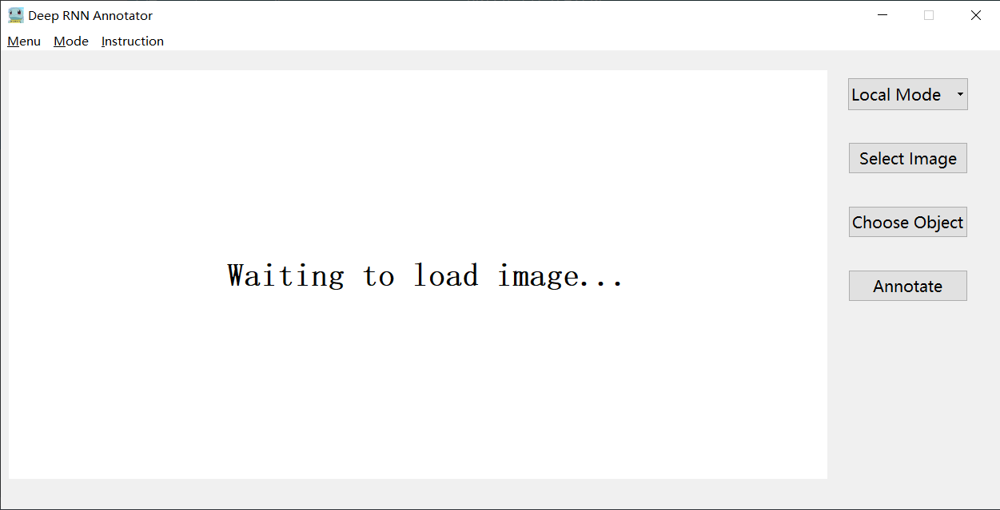
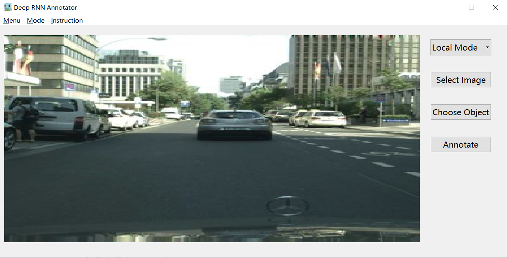
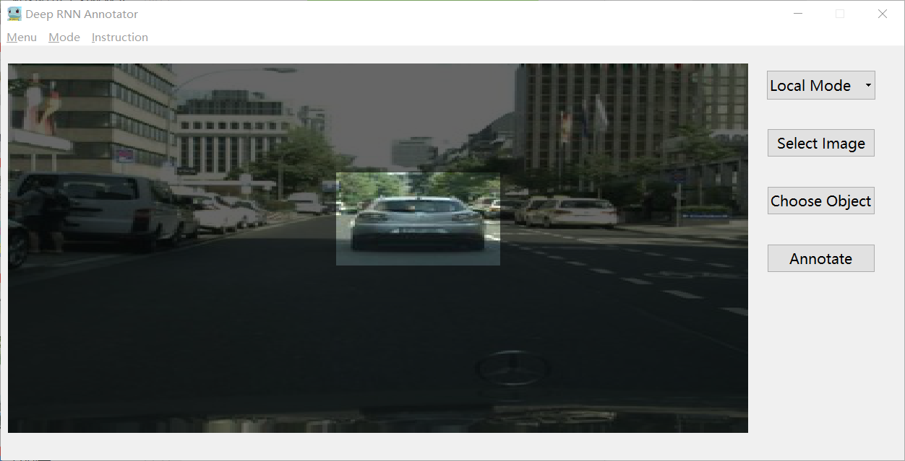
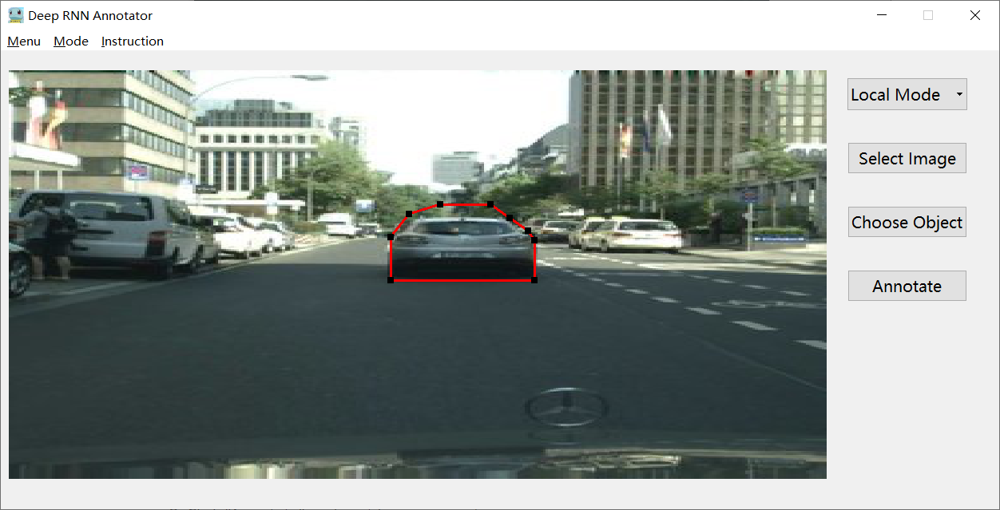

# SCS Framework

## Source Code

### Usage

0. Dependencies:

      - Python 2.7
      - Pytorch >= 0.4
      - torchvision
      - Numpy
      - Pillow
      - tqdm

1. Download Kinetics-400 from the [official website](https://deepmind.com/research/open-source/open-source-datasets/kinetics/) or from the copy of [facebookresearch/video-nonlocal-net](https://github.com/facebookresearch/video-nonlocal-net/blob/master/DATASET.md), and organize the image files (from the videos) the same as  UCF101 and HMDB:

   ```
   Dataset
   ├── train_frames
   │   ├── action0
   │   │   ├── video0
   |   |   |   ├── frame0
   ├── test_frames
   ```

2. Extract optical flow of the original RGB frames. Note that the stride between the two RGB frames used to extract optical flow need to be the same with the original inputs. The optical_flow only need two channel (h and v), but we still save it as jpg padding the third channel to 0. Store the optical flows in ```train_ofs```:

      ```
       Dataset
      ├── train_frames
      │   ├── action0
      │   │   ├── video0
      |   |   |   ├── frame0
      ├── train_ofs
      │   ├── action0
      │   │   ├── video0
      |   |   |   ├── frame0
      ├── test_frames
      ```

3. In this standalone model, we only commit the action recognition task:

   a. Run the following command to train.

      ```
      # start from scratch
      python main.py --train 
      
      # start from our pre-trained model
      python main.py --model_path [path_to_model] --model_name [model's name] --resume --train
      ```

   b. Run the following command to test.

      ```
      python main.py --test
      ```


3. Action recognition results on standalone RNN models:

   | Architecture                  | Kinetics | UCF-101 | HMDB-51 |
   | ----------------------------- | -------- | ------- | ------- |
   | Shallow LSTM with Backbone    | 53.9     | 86.8    | 49.7    |
   | C3D                           | 56.1     | 79.9    | 49.4    |
   | Two-Stream                    | 62.8     | 93.8    | 64.3    |
   | 3D-Fused                      | 62.3     | 91.5    | 66.5    |
   | **Deep RBM without Backbone** | 60.2     | 91.9    | 61.7    |

## Demo

0. Dependencies:

    - Python 3.5
    - Pytorch >= 1.1.0
    - torchvision
    - Numpy
    - Pillow
    - tqdm
    - PyQt5
1. Usage
   1. Download the pre-trained model from [Google Drive](https://drive.google.com/open?id=1O5XNWdj7lkyiA0boR-RuN4zGxO6OHQ6y)  and put it into ```Demo/Code/```
   2. Run the demo by:
   ```
   python main.py
   ```

   3. After get the main window :

      

      1. Click "Select Image":

         

      2. Click "Choose Object" and drag out a bbox for the target

         

      3. Click "Annotate" and wait for a moment （5s on i7 CPU）:

         

         (Because we automatically assign the left-bottom corner as the start point, the result may be not so good in some specific scenes.)
